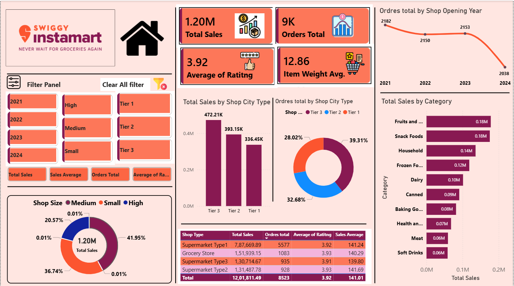

# Swiggy Instamart Sales Dashboard (Power BI)

## 📊 Project Overview
This project presents an interactive Power BI dashboard analyzing Swiggy Instamart sales data. It provides insights into sales performance, order trends, and category-wise analysis.

## 📷 Dashboard Preview

## 🚀 Key Features
- Total Sales: 1.20M and Orders: 9K  
- Category-wise sales analysis  
- Shop tier comparison (Tier 1, Tier 2, Tier 3)  
- Order trends by shop opening year  
- Shop size contribution analysis  
- Interactive filters  

## 📈 Business Insights
- Tier 3 shops generate highest sales  
- Fruits and Snack Foods are top categories  
- Sales trend varies by year  

## 🛠️ Tools Used
- Power BI  
- Excel  

## 📂 Files
- Project 2.pbix  
- Instamart_Data.xlsx  
